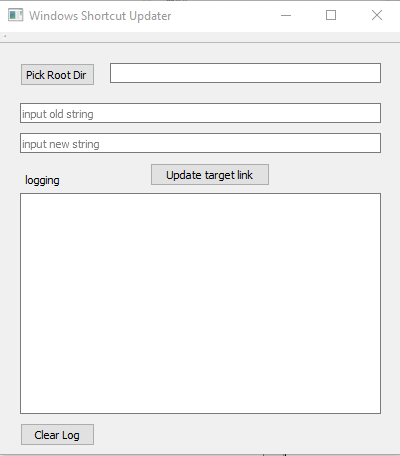

# Windows Shortcut Manager

This program is to update shortcut automatic. This works at window system. 
The external storage device is now common. And people need to connect the device into many different machines. But you may find that the shortcut doesn’t work anymore because the driver letter is changed. Or sometimes, you want to organize your file system and change the name of folder. But it is pain to change all the shortcuts at the same time pointing to the files inside the folder. 
This program helps to update shortcut easily. It recursively searches through all the shortcuts in side starting directory and find string pattern and replace it with new string. 

